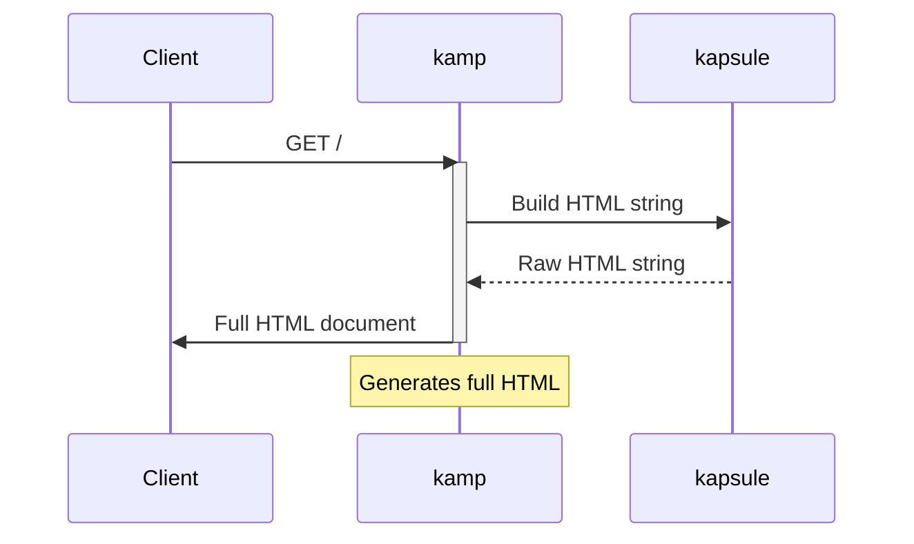

# kamp

personal site / portfolio built with Ktor and [kapsule](https://github.com/sakethpathike/kapsule).

### Request Flow

### kamp?
*kamp* as in _camp_. Maybe not Clemens Point or Horseshoe Overlook, but on the internet.
