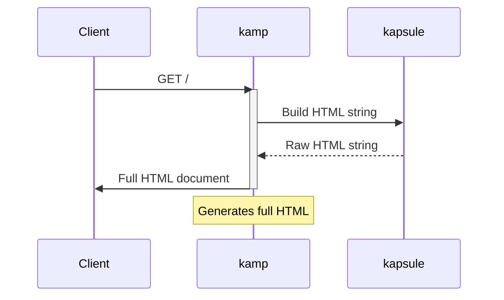

# kamp

kamp serves data and handles HTML generation for my personal site/portfolio, built with ktor and [kapsule](https://github.com/sakethpathike/kapsule).

The blog _posts_ are written in standard Markdown files, parsed by a custom parser (i've written it based on [this spec](https://spec.commonmark.org/0.31.2/#appendix-a-parsing-strategy), but it doesn't strictly follow it; I took it as reference), and kapsule is used to generate the html based on the parsed Markdown nodes.

### Request Flow

### kamp?

*kamp* as in _camp_. Maybe not Clemens Point or Horseshoe Overlook, but on the internet.
